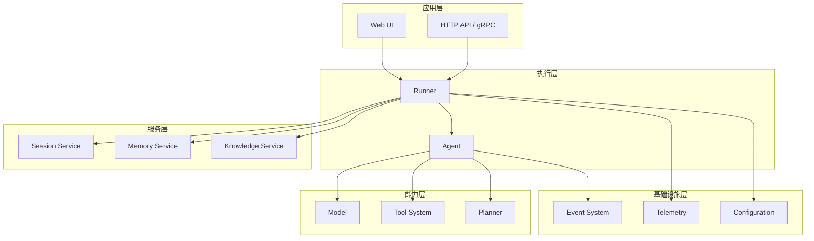
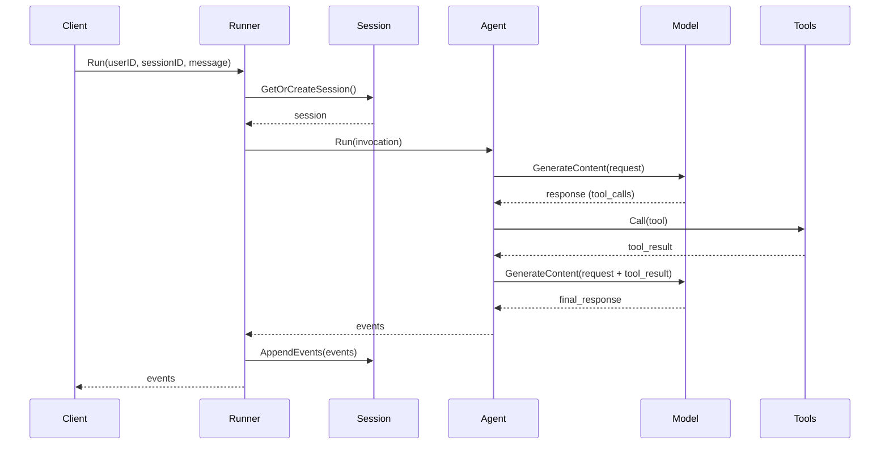

# tRPC-Agent-Go 核心架构

## 架构概览

tRPC-Agent-Go 采用模块化架构设计，由多个核心组件组成，组件都可插拔，通过事件驱动机制实现组件间的解耦通信。



## 核心组件详解

### 1. Runner (执行器)

**职责**: Agent 执行器，负责管理执行流程，串联 Session/Memory Service 等能力

**核心功能**:
- 会话管理与状态维护
- 事件流处理与分发
- 生命周期管理
- 错误处理与恢复
- 插件系统集成

**关键接口**:
```go
type Runner interface {
    Run(ctx context.Context, userID, sessionID string, message model.Message, opts ...agent.RunOption) (<-chan *event.Event, error)
    Close() error
}
```

### 2. Agent (智能体)

**职责**: 核心执行单元，负责处理用户输入并生成响应

**Agent 类型**:

#### LLMAgent
- 基于 LLM 的智能体
- 支持工具调用和推理
- 支持流式输出
- 支持模型动态切换

#### ChainAgent
- 链式执行，支持多步骤任务分解
- 子 Agent 按顺序执行
- 支持条件分支

#### ParallelAgent
- 并行处理，支持多专家协作
- 子 Agent 并发执行
- 结果聚合与合并

#### CycleAgent
- 循环迭代，支持自我优化
- 基于条件终止循环
- 支持迭代次数限制

#### GraphAgent
- 图工作流，兼容现有编排习惯
- 支持复杂条件路由
- 状态管理与传递

### 3. Model (模型抽象)

**职责**: 统一的 LLM 接口，屏蔽不同模型提供商差异

**支持平台**:
- OpenAI (GPT-4o, GPT-4o-mini)
- DeepSeek (deepseek-chat, deepseek-reasoner)
- 腾讯混元 (hunyuan-2.0-thinking)
- Anthropic Claude (claude-3-5-sonnet, claude-3-5-haiku)
- 其他 OpenAI 兼容 API

**核心特性**:
- 统一接口抽象
- 流式响应支持
- 多模态能力
- 完整错误处理
- 可扩展配置

### 4. Tool System (工具系统)

**职责**: 为 Agent 提供与外部服务和功能交互的能力

**工具类型**:

#### Function Tools
- 直接调用 Go 函数实现的工具
- 支持流式和非流式响应
- 自动参数序列化/反序列化

#### Agent Tool
- 将 Agent 包装为可调用工具
- 支持流式内部转发
- 支持历史作用域控制

#### MCP ToolSet
- 基于 MCP 协议的外部工具集
- 支持 STDIO、SSE、Streamable HTTP 三种传输方式
- 支持会话重连和动态发现

#### DuckDuckGo Tool
- 基于 DuckDuckGo API 的搜索工具
- 提供事实性、百科类信息搜索

### 5. Session Service (会话服务)

**职责**: 管理用户会话状态和事件

**存储方式**:
- In-Memory: 内存存储，适合单机部署
- Redis: 分布式存储，支持集群部署

**核心功能**:
- 会话创建与获取
- 事件存储与查询
- 状态管理
- TTL 支持

### 6. Memory Service (记忆服务)

**职责**: 记录用户的长期记忆和个性化信息

**核心功能**:
- 长期记忆存储
- 个性化信息管理
- 记忆搜索与检索
- 记忆更新与删除

### 7. Knowledge Service (知识服务)

**职责**: 实现 RAG 知识检索能力

**核心功能**:
- 文档向量化
- 相似度搜索
- 知识库管理
- 检索增强生成

### 8. Planner (规划器)

**职责**: 提供 Agent 的计划和推理能力

**核心功能**:
- 任务分解
- 步骤规划
- 动态调整
- 结果评估

## 数据流与执行流程

### 标准执行流程



### 事件驱动架构

框架采用事件驱动架构，所有组件间通过事件进行通信：

**事件类型**:
- 模型对话事件
- 工具调用与响应事件
- Agent 转移事件
- 错误事件
- 完成事件

**事件结构**:
```go
type Event struct {
    Response     *model.Response `json:"response"`
    InvocationID string          `json:"invocationId"`
    Author       string          `json:"author"`
    ID           string          `json:"id"`
    Timestamp    time.Time       `json:"timestamp"`
    Branch       string          `json:"branch,omitempty"`
    RequiresCompletion bool      `json:"requiresCompletion,omitempty"`
    LongRunningToolIDs map[string]struct{} `json:"longRunningToolIDs,omitempty"`
}
```

## 扩展机制

### 插件系统

Runner 支持插件机制，允许在全局范围内注入自定义逻辑：

```go
r := runner.NewRunner("my-app", agent,
    runner.WithPlugins(
        plugin.NewLogging(),
        plugin.NewGlobalInstruction("You must follow security policies."),
    ),
)
```

### 回调机制

框架提供多级回调机制，支持在关键节点注入自定义逻辑：

- Agent Callbacks: 在 Agent 执行前后触发
- Model Callbacks: 在模型调用前后触发
- Tool Callbacks: 在工具调用前后触发

### 自定义实现

所有核心组件都基于接口设计，支持自定义实现：

- 自定义 Model: 实现 `model.Model` 接口
- 自定义 Tool: 实现 `tool.Tool` 接口
- 自定义 Session: 实现 `session.Service` 接口
- 自定义 Memory: 实现 `memory.Service` 接口

## 设计模式

### 依赖注入

框架广泛使用依赖注入模式，通过接口抽象实现组件间的解耦：

```go
agent := llmagent.New("assistant",
    llmagent.WithModel(model),           // 注入 Model
    llmagent.WithTools(tools),           // 注入 Tool 列表
    llmagent.WithMemoryService(memory),  // 注入 Memory Service
)
```

### 建造者模式

组件创建采用建造者模式，提供灵活的配置选项：

```go
model := openai.New("gpt-4o-mini",
    openai.WithAPIKey("key"),
    openai.WithBaseURL("url"),
    openai.WithHeaders(headers),
)
```

### 策略模式

工具执行、模型选择等采用策略模式，支持运行时动态切换：

```go
// 运行时切换模型
agent.SetModelByName("smart")

// 运行时过滤工具
runner.Run(ctx, userID, sessionID, message,
    agent.WithToolFilter(filter),
)
```

## 架构优势

1. **高内聚低耦合**: 各组件职责清晰，接口定义明确
2. **可扩展性**: 支持自定义实现和第三方扩展
3. **可测试性**: 组件间解耦，便于单元测试和集成测试
4. **可观测性**: 内置事件系统和追踪机制
5. **生产就绪**: 考虑了错误处理、资源管理等生产环境需求

## 相关文档

- [框架概述](./framework-overview.md)
- [技术特性](./technical-features.md)
- [开发模式](./development-patterns.md)
- [高级功能](./advanced-features.md)
## 架构概览

tRPC-Agent-Go 采用模块化架构设计，由多个核心组件组成，组件都可插拔，通过事件驱动机制实现组件间的解耦通信。


## 核心组件详解

### 1. Runner (执行器)

**职责**: Agent 执行器，负责管理执行流程，串联 Session/Memory Service 等能力

**核心功能**:
- 会话管理与状态维护
- 事件流处理与分发
- 生命周期管理
- 错误处理与恢复
- 插件系统集成

**关键接口**:
```go
type Runner interface {
    Run(ctx context.Context, userID, sessionID string, message model.Message, opts ...agent.RunOption) (<-chan *event.Event, error)
    Close() error
}
```

### 2. Agent (智能体)

**职责**: 核心执行单元，负责处理用户输入并生成响应

**Agent 类型**:

#### LLMAgent
- 基于 LLM 的智能体
- 支持工具调用和推理
- 支持流式输出
- 支持模型动态切换

#### ChainAgent
- 链式执行，支持多步骤任务分解
- 子 Agent 按顺序执行
- 支持条件分支

#### ParallelAgent
- 并行处理，支持多专家协作
- 子 Agent 并发执行
- 结果聚合与合并

#### CycleAgent
- 循环迭代，支持自我优化
- 基于条件终止循环
- 支持迭代次数限制

#### GraphAgent
- 图工作流，兼容现有编排习惯
- 支持复杂条件路由
- 状态管理与传递

### 3. Model (模型抽象)

**职责**: 统一的 LLM 接口，屏蔽不同模型提供商差异

**支持平台**:
- OpenAI (GPT-4o, GPT-4o-mini)
- DeepSeek (deepseek-chat, deepseek-reasoner)
- 腾讯混元 (hunyuan-2.0-thinking)
- Anthropic Claude (claude-3-5-sonnet, claude-3-5-haiku)
- 其他 OpenAI 兼容 API

**核心特性**:
- 统一接口抽象
- 流式响应支持
- 多模态能力
- 完整错误处理
- 可扩展配置

### 4. Tool System (工具系统)

**职责**: 为 Agent 提供与外部服务和功能交互的能力

**工具类型**:

#### Function Tools
- 直接调用 Go 函数实现的工具
- 支持流式和非流式响应
- 自动参数序列化/反序列化

#### Agent Tool
- 将 Agent 包装为可调用工具
- 支持流式内部转发
- 支持历史作用域控制

#### MCP ToolSet
- 基于 MCP 协议的外部工具集
- 支持 STDIO、SSE、Streamable HTTP 三种传输方式
- 支持会话重连和动态发现

#### DuckDuckGo Tool
- 基于 DuckDuckGo API 的搜索工具
- 提供事实性、百科类信息搜索

### 5. Session Service (会话服务)

**职责**: 管理用户会话状态和事件

**存储方式**:
- In-Memory: 内存存储，适合单机部署
- Redis: 分布式存储，支持集群部署

**核心功能**:
- 会话创建与获取
- 事件存储与查询
- 状态管理
- TTL 支持

### 6. Memory Service (记忆服务)

**职责**: 记录用户的长期记忆和个性化信息

**核心功能**:
- 长期记忆存储
- 个性化信息管理
- 记忆搜索与检索
- 记忆更新与删除

### 7. Knowledge Service (知识服务)

**职责**: 实现 RAG 知识检索能力

**核心功能**:
- 文档向量化
- 相似度搜索
- 知识库管理
- 检索增强生成

### 8. Planner (规划器)

**职责**: 提供 Agent 的计划和推理能力

**核心功能**:
- 任务分解
- 步骤规划
- 动态调整
- 结果评估

## 数据流与执行流程

### 标准执行流程


### 事件驱动架构

框架采用事件驱动架构，所有组件间通过事件进行通信：

**事件类型**:
- 模型对话事件
- 工具调用与响应事件
- Agent 转移事件
- 错误事件
- 完成事件

**事件结构**:
```go
type Event struct {
    Response     *model.Response `json:"response"`
    InvocationID string          `json:"invocationId"`
    Author       string          `json:"author"`
    ID           string          `json:"id"`
    Timestamp    time.Time       `json:"timestamp"`
    Branch       string          `json:"branch,omitempty"`
    RequiresCompletion bool      `json:"requiresCompletion,omitempty"`
    LongRunningToolIDs map[string]struct{} `json:"longRunningToolIDs,omitempty"`
}
```

## 扩展机制

### 插件系统

Runner 支持插件机制，允许在全局范围内注入自定义逻辑：

```go
r := runner.NewRunner("my-app", agent,
    runner.WithPlugins(
        plugin.NewLogging(),
        plugin.NewGlobalInstruction("You must follow security policies."),
    ),
)
```

### 回调机制

框架提供多级回调机制，支持在关键节点注入自定义逻辑：

- Agent Callbacks: 在 Agent 执行前后触发
- Model Callbacks: 在模型调用前后触发
- Tool Callbacks: 在工具调用前后触发

### 自定义实现

所有核心组件都基于接口设计，支持自定义实现：

- 自定义 Model: 实现 `model.Model` 接口
- 自定义 Tool: 实现 `tool.Tool` 接口
- 自定义 Session: 实现 `session.Service` 接口
- 自定义 Memory: 实现 `memory.Service` 接口

## 设计模式

### 依赖注入

框架广泛使用依赖注入模式，通过接口抽象实现组件间的解耦：

```go
agent := llmagent.New("assistant",
    llmagent.WithModel(model),           // 注入 Model
    llmagent.WithTools(tools),           // 注入 Tool 列表
    llmagent.WithMemoryService(memory),  // 注入 Memory Service
)
```

### 建造者模式

组件创建采用建造者模式，提供灵活的配置选项：

```go
model := openai.New("gpt-4o-mini",
    openai.WithAPIKey("key"),
    openai.WithBaseURL("url"),
    openai.WithHeaders(headers),
)
```

### 策略模式

工具执行、模型选择等采用策略模式，支持运行时动态切换：

```go
// 运行时切换模型
agent.SetModelByName("smart")

// 运行时过滤工具
runner.Run(ctx, userID, sessionID, message,
    agent.WithToolFilter(filter),
)
```

## 架构优势

1. **高内聚低耦合**: 各组件职责清晰，接口定义明确
2. **可扩展性**: 支持自定义实现和第三方扩展
3. **可测试性**: 组件间解耦，便于单元测试和集成测试
4. **可观测性**: 内置事件系统和追踪机制
5. **生产就绪**: 考虑了错误处理、资源管理等生产环境需求

## 相关文档

- [框架概述](./framework-overview.md)
- [技术特性](./technical-features.md)
- [开发模式](./development-patterns.md)
- [高级功能](./advanced-features.md)
