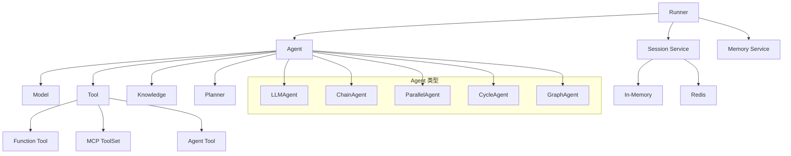

# tRPC-Agent-Go 框架概述

## 简介

tRPC-Agent-Go 是一个基于 Go 语言的 AI 智能体系统框架，使用 tRPC 协议实现高性能的智能代理功能。该框架填补了 Go 生态中 AI Agent 框架的空白，特别适合需要"智能+性能"双重需求的复杂业务场景。

## 核心价值

- **Go 语言优势**: 利用 Go 的高并发、高性能特性，适合微服务和分布式部署
- **企业级可靠性**: 经过腾讯内部大规模业务验证（腾讯元宝、腾讯视频、腾讯新闻等）
- **完整生态**: 提供从基础模型调用到复杂多 Agent 协作的全套解决方案
- **生产就绪**: 内置可观测性、追踪和企业级可靠性特性

## 框架定位

与主流 Python Agent 框架（如 AutoGen、CrewAI、Agno）不同，tRPC-Agent-Go 专注于：

1. **性能优先**: 利用 Go 语言的并发优势，实现低延迟、高吞吐的 Agent 系统
2. **企业级特性**: 提供完整的可观测性、追踪和监控能力
3. **生产部署**: 支持水平扩展、无状态设计，适合大规模生产环境
4. **Go 生态集成**: 与现有的 Go 微服务架构无缝集成

## 核心组件关系



## 设计原则

1. **模块化设计**: 各组件职责清晰，可独立使用和测试
2. **接口驱动**: 通过标准接口实现组件间的解耦
3. **事件驱动**: 基于事件流实现异步通信和状态管理
4. **可扩展性**: 支持自定义实现和第三方扩展
5. **生产友好**: 内置监控、追踪和错误处理机制

## 技术栈

- **语言**: Go 1.21+
- **协议**: tRPC (Tencent RPC)
- **模型支持**: OpenAI、DeepSeek、腾讯混元、Anthropic Claude 等
- **存储**: Redis、PostgreSQL、MySQL (可选)
- **监控**: OpenTelemetry、Prometheus、Grafana (可选)

## 快速体验

```go
// 创建模型
model := openai.New("deepseek-chat")

// 创建 Agent
agent := llmagent.New("assistant",
    llmagent.WithModel(model),
    llmagent.WithInstruction("你是一个有帮助的AI助手"),
)

// 创建 Runner
runner := runner.NewRunner("my-app", agent)
defer runner.Close()

// 运行对话
events, err := runner.Run(ctx, userID, sessionID, message)
for event := range events {
    // 处理流式响应
}
```

## 学习路径

1. **基础概念**: 理解 Agent、Runner、Model 等核心组件
2. **工具系统**: 掌握 Function Tool、MCP Tool 等工具集成
3. **多 Agent 协作**: 学习 Chain、Parallel、Graph 等协作模式
4. **高级特性**: 掌握 Memory、Knowledge、Skills 等高级功能
5. **生产部署**: 了解监控、追踪、扩展等生产环境考虑

## 相关文档

- [核心架构](./core-architecture.md)
- [技术特性](./technical-features.md)
- [开发模式](./development-patterns.md)
- [高级功能](./advanced-features.md)
- [应用场景](./use-cases.md)
- [性能与可靠性](./performance-reliability.md)
## 简介

tRPC-Agent-Go 是一个基于 Go 语言的 AI 智能体系统框架，使用 tRPC 协议实现高性能的智能代理功能。该框架填补了 Go 生态中 AI Agent 框架的空白，特别适合需要"智能+性能"双重需求的复杂业务场景。

## 核心价值

- **Go 语言优势**: 利用 Go 的高并发、高性能特性，适合微服务和分布式部署
- **企业级可靠性**: 经过腾讯内部大规模业务验证（腾讯元宝、腾讯视频、腾讯新闻等）
- **完整生态**: 提供从基础模型调用到复杂多 Agent 协作的全套解决方案
- **生产就绪**: 内置可观测性、追踪和企业级可靠性特性

## 框架定位

与主流 Python Agent 框架（如 AutoGen、CrewAI、Agno）不同，tRPC-Agent-Go 专注于：

1. **性能优先**: 利用 Go 语言的并发优势，实现低延迟、高吞吐的 Agent 系统
2. **企业级特性**: 提供完整的可观测性、追踪和监控能力
3. **生产部署**: 支持水平扩展、无状态设计，适合大规模生产环境
4. **Go 生态集成**: 与现有的 Go 微服务架构无缝集成

## 核心组件关系


## 设计原则

1. **模块化设计**: 各组件职责清晰，可独立使用和测试
2. **接口驱动**: 通过标准接口实现组件间的解耦
3. **事件驱动**: 基于事件流实现异步通信和状态管理
4. **可扩展性**: 支持自定义实现和第三方扩展
5. **生产友好**: 内置监控、追踪和错误处理机制

## 技术栈

- **语言**: Go 1.21+
- **协议**: tRPC (Tencent RPC)
- **模型支持**: OpenAI、DeepSeek、腾讯混元、Anthropic Claude 等
- **存储**: Redis、PostgreSQL、MySQL (可选)
- **监控**: OpenTelemetry、Prometheus、Grafana (可选)

## 快速体验

```go
// 创建模型
model := openai.New("deepseek-chat")

// 创建 Agent
agent := llmagent.New("assistant",
    llmagent.WithModel(model),
    llmagent.WithInstruction("你是一个有帮助的AI助手"),
)

// 创建 Runner
runner := runner.NewRunner("my-app", agent)
defer runner.Close()

// 运行对话
events, err := runner.Run(ctx, userID, sessionID, message)
for event := range events {
    // 处理流式响应
}
```

## 学习路径

1. **基础概念**: 理解 Agent、Runner、Model 等核心组件
2. **工具系统**: 掌握 Function Tool、MCP Tool 等工具集成
3. **多 Agent 协作**: 学习 Chain、Parallel、Graph 等协作模式
4. **高级特性**: 掌握 Memory、Knowledge、Skills 等高级功能
5. **生产部署**: 了解监控、追踪、扩展等生产环境考虑

## 相关文档

- [核心架构](./core-architecture.md)
- [技术特性](./technical-features.md)
- [开发模式](./development-patterns.md)
- [高级功能](./advanced-features.md)
- [应用场景](./use-cases.md)
- [性能与可靠性](./performance-reliability.md)
